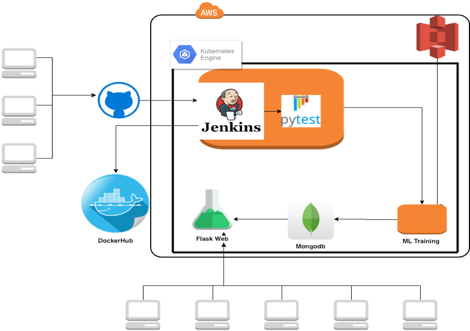

# MLBAKER
This is a pipeline of baking Jenkins to K8s to dynamic allocate training pods for different ML models

# What MLBaker can do?
##  This is a simple demo to show how the MLbaker works 

https://drive.google.com/open?id=1HlnlsjRgCrWFRWUZP828Wjwmx03Cp0yU

##  Architecture

## Jenkinsfile to Dynamic Allocate K8s Training Pod

